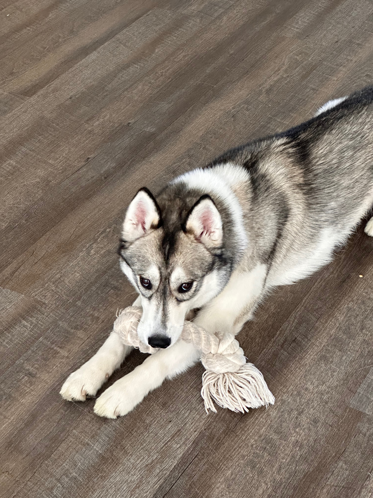

<header>
# Sergio's Wind & Wheels
</header>

_Step into the adventurous life of Sergio, where the winds of flying, the wheels of motorcycles, and the waves of sailing create unforgettable experiences. Accompanied by his husky, Sergio takes you on a journey like no other._

## Flying machines

From a young age, Sergei was captivated by the world of aviation. Building small aircraft models and controlling them from the ground ignited a passion within him. These models were not just toys; they were the seeds of a dream. Sergei always imagined himself in the cockpit of a real airplane, soaring through the skies. In 2017, he took the first steps towards making this dream a reality by enrolling in flight training at AeroDynamic Aviation in San Jose, CA.

Under the guidance of his instructor, Batelle Rachmian, Sergei dedicated himself to mastering the art of flying. His hard work and perseverance paid off on April 4, 2018, when he made his first solo flight in a Cessna 172, aircraft N61637. That day, Sergei performed two takeoffs and two landings, a monumental achievement that marked the beginning of his journey as a pilot. He felt an exhilarating mix of nerves and excitement as he handled the aircraft on his own, the culmination of years of dreaming and months of rigorous training.

"When I was a kid, I was building small aircraft models. Building these models and controlling them from the ground was really interesting and exciting, but my real dream was to become a pilot someday and fly a real airplane. Finally, I achieved my dream here at AeroDynamic, and I made my first solo flight in a Cessna 172, making two takeoffs and two landings. Many thanks to my instructor, Batelle. I’m looking forward to getting my private pilot license and flying across the country (and maybe other countries), discovering new places." ~ Sergei

[source](https://www.aerodynamicaviation.com/first-solo-flight-sergei-pichugin/)

## Husky-kolbaski

Jackie the Siberian Husky was a bundle of energy and joy. At just 1 year and 3 months old, she was still very much a puppy, with a zest for life that was both charming and exhausting. She loved to play and run around, her playful antics bringing laughter and smiles to everyone who met her. However, Jackie was also known for her stubborn streak, which only added to her endearing and funny personality.

One sunny afternoon, Jackie was let out into the backyard to enjoy some fresh air and exercise. She had a habit of exploring every nook and cranny, and today was no different. As she sniffed around the fence line, a particularly interesting scent caught her attention. Before anyone could react, Jackie had found a small gap under the fence and wriggled her way through it, disappearing into the neighborhood beyond.

When her owner realized Jackie was missing, panic set in. The neighborhood was vast, and Jackie could be anywhere. Calls of "Jackie! Jackie!" echoed through the streets, but there was no sign of the playful husky. Hours turned into a long and anxious night, with her owner fearing the worst.

In a moment of desperation, her owner turned to the local Facebook community. A heartfelt post was made, describing Jackie and asking if anyone had seen her. The response was overwhelming. Dozens of people shared the post, offering words of encouragement and keeping an eye out for the runaway husky.

Early the next morning, a message came in from a neighbor who lived a few blocks away. She had seen a husky matching Jackie's description playing in her front yard. With renewed hope, Jackie's owner rushed to the location, calling out for her.

Sure enough, there was Jackie, looking as if she had just been on a grand adventure. Her tail wagged furiously as she saw her owner, and she bounded over with all the enthusiasm of a puppy who had no idea how worried everyone had been. It was a joyous reunion, filled with hugs, happy barks, and a few relieved tears.

Thanks to the power of the community and the kindness of strangers, Jackie was safely back home. Her adventurous spirit hadn't waned, but now there was a renewed effort to make sure the backyard was escape-proof. Jackie, with her playful and stubborn nature, continued to bring endless joy and laughter, reminding everyone just how precious she was.

## New articles
[070324 - Why is it so complicated to create APIs in the modern world - tech bureaucracy](articles/why-is-it-so-complicated-to-write-apis-now/why-is-it-so-complicated-to-write-apis-now-en.md)

## Misc
[Coffee](articles/coffee/coffee-en.md)
[Кофе](articles/coffee/coffee-ru.md)
## Old articles

[051613 - Insomnia](articles/old/051613-insomnia-en.md)

<footer>
mailto: spichug+blog@gmail.com
</footer>
