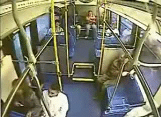
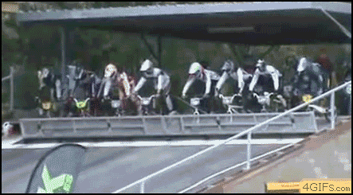

# Insomnia 

--> [RU](051613-insomnia-ru.md) <--

Working remotely turned out to be too difficult for my body, especially when there's an 11-hour time difference with the main action happening elsewhere. I synchronized the clock on one of the servers in California with their local time, so now I know where to find the exact time in Cupertino. Otherwise, I keep calculating like a schoolboy...

And here it comes again, insomnia, and on top of that, summer arrived in May
Completely lost the desire to sleep. I've always been curious about what would happen if an almost empty bus crashed at high speed into an obstacle that would stop it. I stumbled upon a picture:

The driver reacted instantly to the calls about the missed stop.
The driver reacted instantly to the calls about the missed stop.

I still need to find a similar one with a train. The guys rolled so perfectly that apparently the impact was not direct, but from the side. The person sitting in the back on the left climbed out of his hole quite briskly. The old man on the right slid down so neatly that it seemed like he spent most of his life in our minibuses. But he still stares intently at the artifact that flew in. It immediately reminded me of a game where you had to roll balls across a field and drive them into holes, and when a naughty ball would take the wrong hole, you'd shake it good so they all rolled out...

Recently, I took an exam for admission to some long-term Japanese language course. The exam anxiety came back... great feelings. I remember when I was in university, there were too many of them, but now it seems I miss it. By the way, the last time I was nervous was when I was taking a navigation exam, but navigation was much easier. University was oversaturated with exam stress, so much so that sometimes I dream about failed differential equations or that my diploma is taken away during re-evaluation. Horrors. I wake up in a cold sweat like Officer Ripley from "Aliens". So, the Japanese exam – at the beginning of the year they gave us books and told us to watch video lessons. I came, watched, read the book... In the middle of the course, I decided to ask if I needed to learn Hiragana and Katakana (these are two phonetic alphabets, the first for writing Japanese and Chinese words, the second for borrowed words). They said I did because in the first year you need to already be able to read and write, which is funny because neither the book nor the video course mentioned Katakana. Only Hiragana and rarely encountered words in Katakana, so it became clear that the test relative to the material is not easy at all. And you have to think for yourself, so I started reading the internet and learning the alphabets. The classification and presentation of the material in the book are quite old-fashioned, on the websites everything is much more systematic. Also, the guys who attended asked for a sample test. As it turned out, it is quite serious and you just need to memorize the book. But it's hardly like a poem, so it doesn't learn easily. It turned out to be very interesting, it's worth it. Reading comes out syllable by syllable like in the third grade (yeah, I'm slow hahahahaha or maybe I'm just not interested), especially new words. In general, I rewrote almost the entire book into a notebook and it helped me remember. At the exam, some people just handed in their sheets and left with the words "well, I already know my result". Funny, let's see what happens next.

Recently a friend put on the song "Creep" by Radiohead in karaoke. I remember the first time we sang it with the DJ, it turned out cool. I downloaded all of Radiohead, it's very good for insomnia – if anyone has problems, I recommend it!

In karaoke, we're futilely trying to find Muse's "New Born"... I'd love to belt it out from the heart!

I've always had a pinch of irony towards incomprehensible sports:

--> [RU](051613-insomnia-ru.md) <--

