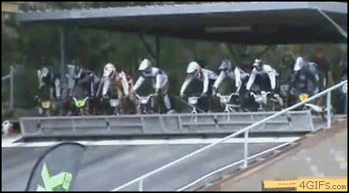

# Безсонница

--> [EN](051613-insomnia-en.md) <--

Работать удаленно оказалось через чур сложно для организма, особенно когда разница во времени 11 часов с тем местом где происходит основное действие. Синхронизировал часики на одном из серверов в калифорнии с их местным временем, теперь знаю где можно узнать точное времечко в купертино. А то постоянно высчитываю как школьник…

И вот она снова пришла, бессонница да ещё и лето в мае наступило :D желания спать отбило напрочь. Мне всегда было интересно, что будет если почти пустой автобус врежется на скорости в препядствие, которое его остановит. Набрел на картинку:

водитель молниеносно отреагировал на позывы о пропущенной остановке
водитель молниеносно отреагировал на позывы о пропущенной остановке

Осталось ещё найти такую же с поездом. Ребята настолько отлично скатываются что по-видимому удар был не прямой, а с боку. Человек, сидящий на заднем плане слева, выбрался из своей лунки достаточно бодро. Дед справа так аккуратно сполз, что сложилось мнение будто он большую часть жизни провел в наших маршрутках. Но всё же он отлично пялится на прилетевший артефакт. Мне сразу же вспомнилась игра, где нужно было катать шарики по полю и загонять в лунки, и вот когда какой нибудь негодный шар займет не ту лунку, и ты тряхнешь так хорошенько что они все выкатятся…

Недавно сдавал экзамен для зачисления на какой-то там продолжительный курс изучения японского языка. Вернулись переживания перед сдачей экзамена… отличные ощущения. Помнится когда учился в университете их было через чур, ну а вот сейчас стало быть соскучился. К слову последний раз волновался когда сдавал навигацию, но навигация была в разы проще. Университет всё же был перенасыщен экзаменационными стрессами, настолько что иногда снятся сны о не сданных дифурах или что диплом отбирают при переаттестации. Ужос. Просыпаюсь в холодном поту словно офицер Рипли из фильма “Чужие”. Стало быть экзамен по японскому, вначале года выдали книжки и сказали смотреть видео уроки. Приходил смотрел, читал книгу… В середине курса решил поинтересоваться, нужно ли учить Хирагану и Катакану (Это две фонетические азбуки, первая для записи японских и китайских слов, вторая для заимствованных). Сказали нужно ибо на первом курсе нужно уже уметь читать и писать, что забавно ни в книге ни в видео курсе про катакану не слова. Лишь только хирагана и редко встречающиеся слова на катакане, стало понятно что тест относительно материала совсем не прост. И надо думать головой самому, стал читать интернеты и учить азбуки. Классификация и подача материала в книге достаточно старовата, на сайтах всё гораздо систематизированнее. Так же ребятки которые ходили выпросили пример теста. Как оказалось он достаточно серьезный и надо просто выучить книгу наизусть. Но на стихотворение это мало похоже поэтому учится не легко. Получилось очень интересно, оно того стоит. Читать получается по слогам как в третьем классе (да я тормоз хахахаххаха или может быть мне просто неинтересно), особенно новые слова. В общем я переписал практически всю книгу в тетрадь и это помогло мне в запоминании. На экзамене же некоторые люди просто сдавали листки и уходили со словами “ну свой результат я уже знаю”. Забавно, посмотрим что будет дальше.

Недавно друг в караоке поставил песню creep, radiohead’a. Помню первый раз пели её с диджеем, получилось прикольно. Скачал весь радиохеад, очень хорошо подходит для бессонницы – у кого проблемы советую! :D

В караотцке тщетно пытаемся найти muse – new born… а так бы хотелось поорать её  от души!

Я всегда относился с щепоткой иронии к непонятным видам спорта:

--> [EN](051613-insomnia-en.md) <--
